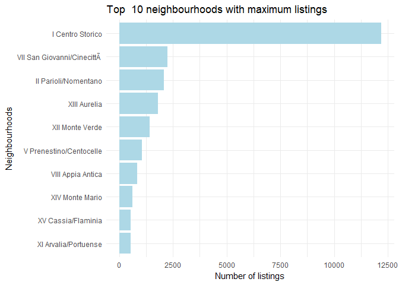
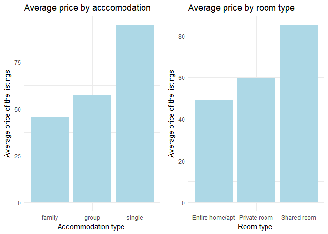
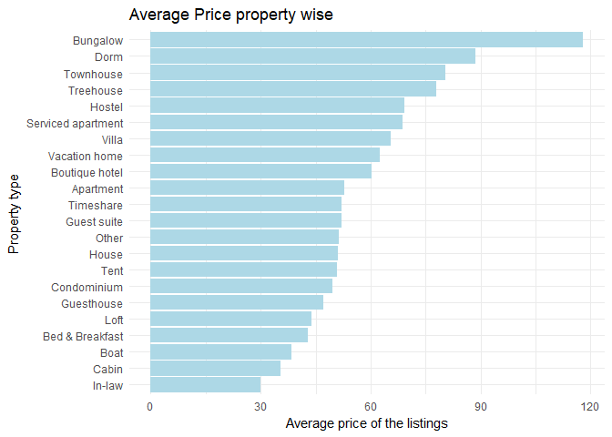
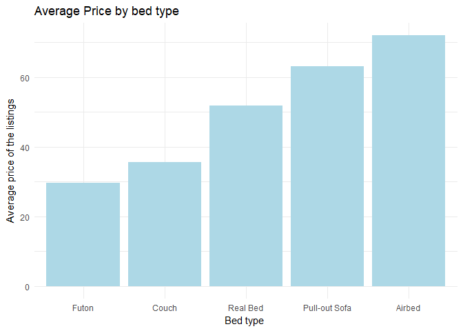
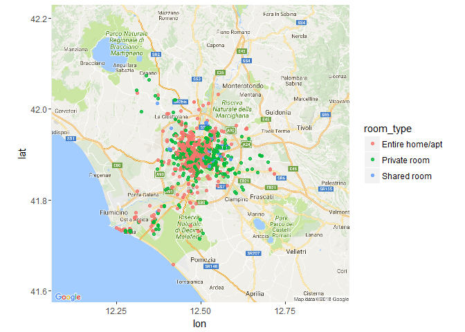
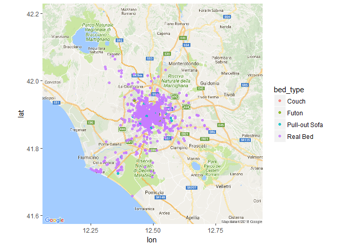
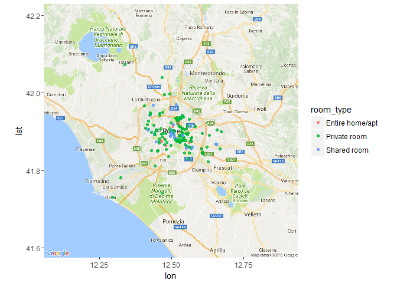
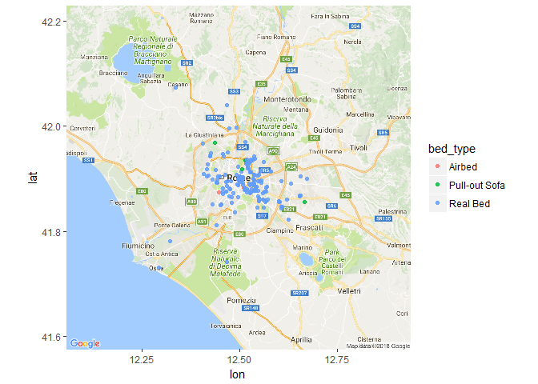

# When in Rome...
Soura Pratim Datta  
3rd December, 2017  


> **_"Every one soon or late comes round by Rome."_** - _Robert Browning_

[Rome](https://en.wikipedia.org/wiki/Rome) has beckoned travelers from afar for quite a few decades now. If Italy represents romance, Rome stands for intimacy. Intimacy between its glorious past and urban present. Intimacy between its spellbinding art and inspiring culture.   There is always more to Rome, and no matter how many trips you take, there will always be more to Rome. Needless to say that Rome receives millions of tourists each year. Rome is the 11th most visited city in the world and 3rd most visited in Europe.


## Introduction

### Problem Statement

The purpose of this project is to perform exploratory analysis on the AirBnB rental data for Rome and understand the following:

 * What are the most affordable neighborhoods for a traveler - family or single; based on room type, property type, bed type etc
 * Among the most affrdable neighbourhoods, which ones have th most listings baed on accommodation type
 
_After all, who doesn't want to travel the world with minimum cost, if not for free?_


### Brief Overview

Since 2008, guests and hosts have used [Airbnb](https://www.airbnb.com/) to travel in a more unique, personalized way. As part of the [Inside Airbnb](http://insideairbnb.com/index.html) initiative, this [dataset](http://insideairbnb.com/get-the-data.html) describes the listing activity of homestays in Rome, Italy and is sourced from publicly available information from the Airbnb site.

Compiled till _8thMay, 2017_, the following Airbnb activity is included in this Rome dataset: 

 * **Listings** - Detailed Listings Data for Rome, including full descriptions and average review score.

 
### Approach

R will be used to perform data analysis and visualization to explore and identify the most affordable neighbourhoods to stay for a solo or family trip. This will be done by categorizing them based on the variables.


### What's in it for you? 

If you are a traveler or planning your next vacation to this exotic city, it will help you find the best neighborhoods to stay. If not, it might just inspire you to pack your bags! <br />


## Packages required 

To perform the analysis to the best of my abilities, I will be using the following R packages:

* [tidyverse](https://cran.r-project.org/web/packages/tidyverse/index.html) - For easy installation of packages and for data manipulation.
* [dplyr](https://cran.r-project.org/web/packages/dplyr/index.html) - A fast, consistent tool for working with data frame like objects, both in memory and out of memory. 
* [stringr](https://cran.r-project.org/web/packages/stringr/index.html) - Simple, Consistent Wrappers for Common String Operations.
* [knitr](https://cran.r-project.org/web/packages/knitr/index.html) - Provides a general-purpose tool for dynamic report generation in R.
* [ggmap](https://cran.r-project.org/web/packages/ggmap/index.html) - A collection of functions to visualize spatial data and models on top of static maps from various online sources
* [DT](https://cran.r-project.org/web/packages/DT/index.html) - Data objects in R can be rendered as HTML tables
* [plotly](https://cran.r-project.org/web/packages/plotly/index.html) - Easily translate 'ggplot2' graphs to an interactive web-based version
* [gridExtra](https://cran.r-project.org/web/packages/gridExtra/index.html) - Provides a number of user-level functions to work with "grid" graphics, notably to arrange multiple grid-based plots on a page, and draw tables.
 


```r
library(tidyverse)
library(dplyr)
library(stringr)
library(knitr)
library(ggmap)
library(DT)
library(plotly)
library(gridExtra)
```


## Data Cleaning and Preparation 

### Background of data 

Inside Airbnb is an independent, non-commercial set of tools and data that allows you to explore how Airbnb is really being used in cities around the world.

By analyzing publicly available information about a city's Airbnb's listings, Inside Airbnb provides filters and key metrics so you can see how Airbnb is being used to compete with the residential housing market.

The data behind the Inside Airbnb site is sourced from publicly available information from the Airbnb site.

Link to the data is available [here](http://insideairbnb.com/get-the-data.html) 


**Loading the datasets**


```r
  listings <- read.csv("D:/Data/AirBnB/AirBnb_listings.csv", na.strings=c(""," ","NA"))
```


### First look of the data

**Dimensions of the datasets**


```r
listings_dim <- dim(listings)
```

* Listings has 25275 rows and 95 columns.
 

**Column names of the datasets**


```r
names(listings)
```

```
##  [1] "id"                               "listing_url"                     
##  [3] "scrape_id"                        "last_scraped"                    
##  [5] "name"                             "summary"                         
##  [7] "space"                            "description"                     
##  [9] "experiences_offered"              "neighborhood_overview"           
## [11] "notes"                            "transit"                         
## [13] "access"                           "interaction"                     
## [15] "house_rules"                      "thumbnail_url"                   
## [17] "medium_url"                       "picture_url"                     
## [19] "xl_picture_url"                   "host_id"                         
## [21] "host_url"                         "host_name"                       
## [23] "host_since"                       "host_location"                   
## [25] "host_about"                       "host_response_time"              
## [27] "host_response_rate"               "host_acceptance_rate"            
## [29] "host_is_superhost"                "host_thumbnail_url"              
## [31] "host_picture_url"                 "host_neighbourhood"              
## [33] "host_listings_count"              "host_total_listings_count"       
## [35] "host_verifications"               "host_has_profile_pic"            
## [37] "host_identity_verified"           "street"                          
## [39] "neighbourhood"                    "neighbourhood_cleansed"          
## [41] "neighbourhood_group_cleansed"     "city"                            
## [43] "state"                            "zipcode"                         
## [45] "market"                           "smart_location"                  
## [47] "country_code"                     "country"                         
## [49] "latitude"                         "longitude"                       
## [51] "is_location_exact"                "property_type"                   
## [53] "room_type"                        "accommodates"                    
## [55] "bathrooms"                        "bedrooms"                        
## [57] "beds"                             "bed_type"                        
## [59] "amenities"                        "square_feet"                     
## [61] "price"                            "weekly_price"                    
## [63] "monthly_price"                    "security_deposit"                
## [65] "cleaning_fee"                     "guests_included"                 
## [67] "extra_people"                     "minimum_nights"                  
## [69] "maximum_nights"                   "calendar_updated"                
## [71] "has_availability"                 "availability_30"                 
## [73] "availability_60"                  "availability_90"                 
## [75] "availability_365"                 "calendar_last_scraped"           
## [77] "number_of_reviews"                "first_review"                    
## [79] "last_review"                      "review_scores_rating"            
## [81] "review_scores_accuracy"           "review_scores_cleanliness"       
## [83] "review_scores_checkin"            "review_scores_communication"     
## [85] "review_scores_location"           "review_scores_value"             
## [87] "requires_license"                 "license"                         
## [89] "jurisdiction_names"               "instant_bookable"                
## [91] "cancellation_policy"              "require_guest_profile_picture"   
## [93] "require_guest_phone_verification" "calculated_host_listings_count"  
## [95] "reviews_per_month"
```

**Taking a subset of the data for easier analysis**

At the first glance of the dataset, we've seen that it contains many irrelevant and redundant columns that we won't want to use in our analysis. Undoubtedly columns such as "host picture url" and "host name" will not help us in our analysis. Thus, subsetting the data set with select columns for ease of analysis.


```r
listings_sub <- listings %>% 
  select(latitude, longitude,neighbourhood_cleansed, price,accommodates,room_type, property_type, bed_type)
```

**A look at the first few rows of the data set**


```r
head(listings_sub, n=10)
```

```
##    latitude longitude neighbourhood_cleansed   price accommodates
## 1  41.92104  12.45260       I Centro Storico  $58.00            2
## 2  41.89132  12.50133       I Centro Storico  $50.00            1
## 3  41.90397  12.49124       I Centro Storico $150.00            2
## 4  41.89091  12.46926       I Centro Storico  $96.00            2
## 5  41.90378  12.48664       I Centro Storico  $89.00            2
## 6  41.91370  12.44948       I Centro Storico $120.00            2
## 7  41.90360  12.49336       I Centro Storico $125.00            3
## 8  41.90971  12.45302       I Centro Storico  $90.00            4
## 9  41.89598  12.46890       I Centro Storico $179.00            4
## 10 41.88906  12.47044       I Centro Storico  $69.00            5
##          room_type   property_type bed_type
## 1     Private room Bed & Breakfast Real Bed
## 2     Private room Bed & Breakfast Real Bed
## 3     Private room       Apartment Real Bed
## 4     Private room           House Real Bed
## 5     Private room Bed & Breakfast Real Bed
## 6     Private room       Apartment Real Bed
## 7     Private room       Apartment Real Bed
## 8     Private room Bed & Breakfast Real Bed
## 9  Entire home/apt       Apartment Real Bed
## 10 Entire home/apt       Apartment Real Bed
```


###Data Cleaning of variables


**Checking for null values**


```r
sum(is.na(listings_sub))
```

```
## [1] 0
```

We see that there are no null values present for any variable


**Price being an important variable in our analysis, performing intial analysis and manipulation on the variable**

**Changing the type of the variable**

First we need to fix up the price variable, which is given to us as a string containing dollar signs, dots, and commas.


```r
listings_sub$price[1:5]
```

```
## [1] $58.00  $50.00  $150.00 $96.00  $89.00 
## 410 Levels: $1,000.00 $1,050.00 $1,400.00 $1,500.00 $1,540.00 ... $999.00
```


**Changing the price variable to type numeric**


```r
listings_sub$price <- as.numeric(listings_sub$price)
```


 **Summary of the variable**
 

```r
summary(listings_sub$price)
```

```
##    Min. 1st Qu.  Median    Mean 3rd Qu.    Max. 
##     1.0   151.0   304.0   249.5   354.0   410.0
```


## Exploratory Data Analysis 

### By Listings

**Listing the top 10 neighbourhoods with the maximum listings**


```r
listings_sub %>% 
   group_by(neighbourhood_cleansed) %>% 
   select(neighbourhood_cleansed) %>% 
   summarise(count = n())%>%
   arrange(desc(count)) %>%
   top_n(10)%>% 
   ggplot()+
  geom_bar(mapping = aes(x=reorder(neighbourhood_cleansed, count),
                          y=count),
            stat="identity", fill = "light blue")  +
   coord_flip() +
   labs(title="Top  10 neighbourhoods with maximum listings",
        x="Neighbourhoods", y="Number of listings") +
   theme_minimal()
```

<!-- -->

It can be seen that the neighbourhood of *I Centro Storico* has the most number of listings with close to 12000 listings up for rent. It is interesting to note that Centro Storico is the historical center of his Italian city. Here's where most visitors would want to spend their time!


**Maximum number of listings lie in which price range?**


```r
listings_sub %>% 
   count(cut_width(price, 10)) %>% 
   arrange(desc(n)) %>% 
  top_n(1)
```

```
## # A tibble: 1 x 2
##   `cut_width(price, 10)`     n
##   <fct>                  <int>
## 1 (385,395]               1757
```

Most of the listings **1757** lie in the price range of 385 - 395 euros.

&nbsp;
&nbsp;
&nbsp;
&nbsp;

### By Price


**Finding the most costliest rental in Rome**


```r
listings_sub %>% 
  filter(price == max(listings_sub$price)) %>% 
  select(neighbourhood_cleansed ,property_type,price)
```

```
##   neighbourhood_cleansed property_type price
## 1        XII Monte Verde     Apartment   410
```

Interestingly this location has a pool and is located close to the vatican. To check the url of this location, click [here](https://www.airbnb.com/rooms/12145062)


**Listing out the neighbourhoods which lie within the 25 and 75 percentile of the price range**


```r
listings_sub %>% 
  filter(price >= quantile(listings_sub$price)[2] & price <= quantile(listings_sub$price)[3]) %>% 
  distinct(neighbourhood_cleansed)
```

```
##         neighbourhood_cleansed
## 1             I Centro Storico
## 2              III Monte Sacro
## 3                 IV Tiburtina
## 4          VI Roma delle Torri
## 5  VII San Giovanni/Cinecittà
## 6            VIII Appia Antica
## 7                       IX Eur
## 8               X Ostia/Acilia
## 9         XI Arvalia/Portuense
## 10             XII Monte Verde
## 11                XIII Aurelia
## 12             XIV Monte Mario
## 13          XV Cassia/Flaminia
## 14        II Parioli/Nomentano
## 15     V Prenestino/Centocelle
```


**Categorising the variable price for better understanding**
 
 * The listings within the 1st Quantile is categorised as *affrodable*
 * The listings within the 1st and 3rd quantile is categorised as *moderate*
 * The listings above the third quantile is categorised as *expensive*

 

```r
 listings_sub$price_cat <- cut(listings_sub$price, c(0, 151, 354, 410), 
                           labels = c("affordable", "moderate", "expensive"))
```


**Total count of each price category**


```r
listings_sub %>% 
   group_by(price_cat) %>% 
   summarise(count=n())
```

```
## # A tibble: 3 x 2
##   price_cat  count
##   <fct>      <int>
## 1 affordable  6327
## 2 moderate   13309
## 3 expensive   5639
```
 
 
 
### A look into affrodable listings

**Subsetting the litsings under the affordable category**


```r
 affordable.rentals <- listings_sub %>% 
   filter(price_cat == "affordable")
```


**Categorising accommodation into 3 types**

 * *Single* - If accommodates 1 person
 * *Family* - If accommodates 2-4 persons
 * *Group* - If accommodates more han 4 persons


```r
affordable.rentals$accommodation_cat <- cut(affordable.rentals$accommodates, c(0,1,4,20), 
                                   labels = c("single", "family", "group"))
```


**Grouping the average prce by accommodation and room type**


```r
 plot1 <- affordable.rentals %>% 
   group_by(accommodation_cat) %>% 
   summarise(mean=mean(price)) %>% 
   ggplot() +
   geom_bar(mapping = aes(x=reorder(accommodation_cat, mean),
                          y=mean),
            stat="identity", fill = "light blue")  +
   labs(title="Average price by acccomodation",
        x="Accommodation type ", y="Average price of the listings") +
   theme_minimal()

 plot2 <- affordable.rentals %>% 
   group_by(room_type) %>% 
   summarise(mean=mean(price)) %>% 
   arrange(desc(mean)) %>%
   # top_n(5) %>% 
   ggplot() +
   geom_bar(mapping = aes(x=reorder(room_type, mean),
                          y=mean),
            stat="identity", fill = "light blue")  +
   labs(title="Average price by room type",
        x="Room type ", y="Average price of the listings") +
   theme_minimal() 


grid.arrange(plot1, plot2, ncol=2)
```

<!-- -->


It can be seen that the most priced listings are for *Single* and *Shared Room*. These are mostly hostels and dormitories.


**Grouping the average price by property type**

```r
 affordable.rentals %>% 
   group_by(property_type) %>% 
   summarise(mean=mean(price)) %>% 
   arrange(desc(mean)) %>%
   # top_n(5) %>% 
   ggplot() +
   geom_bar(mapping = aes(x=reorder(property_type, mean),
                          y=mean),
            stat="identity", fill = "light blue")  +
   coord_flip() +
   labs(title="Average Price property wise",
        x="Property type ", y="Average price of the listings") +
   theme_minimal()
```

<!-- -->
 
It can be seen that Bungalows are the most priced proerty types in Rome!


**Grouping the average price by bed type**

```r
 affordable.rentals %>% 
   group_by(bed_type) %>% 
   summarise(mean=mean(price)) %>% 
   arrange(desc(mean)) %>%
   # top_n(5) %>% 
   ggplot() +
   geom_bar(mapping = aes(x=reorder(bed_type, mean),
                          y=mean),
            stat="identity", fill = "light blue")  +
   # coord_flip() +
   labs(title="Average Price by bed type",
        x="Bed type ", y="Average price of the listings") +
   theme_minimal() 
```

<!-- -->


### Affordable listings for family

Further deep diving into our analysis, we can will now check the locations which are most affordable for a family trip.


**Filtering our subsetted data for accommodation of family type**


```r
family.affordable <- affordable.rentals %>% 
  filter(accommodation_cat =="family")
```


**Counting and mapping the locations which accommodate families according to room type**


```r
map <- get_map(location = 'Rome',maptype = "roadmap", zoom = "auto", scale = "auto")

locations <- ggmap(map) + geom_point(aes(x = longitude, y = latitude, color = room_type), data = family.affordable, alpha = 0.8)

locations
```

<!-- -->

```r
family.affordable %>% 
   group_by(room_type) %>% 
   select(room_type) %>% 
   summarise(count = n())
```

```
## # A tibble: 3 x 2
##   room_type       count
##   <fct>           <int>
## 1 Entire home/apt  2256
## 2 Private room     1159
## 3 Shared room        37
```

As can be seen from the map and the count, most of the listing are type *Entire home/apt* and *Private Rooms*. Only 37 of the lisings are of type shared, this is expected as families would would prefer private rooms while travelling.


**Average price of the room types**


```r
family.affordable %>% 
   group_by(room_type) %>%
   summarise(AveragePrice=round(mean(price), 2)) %>% 
   arrange(AveragePrice)
```

```
## # A tibble: 3 x 2
##   room_type       AveragePrice
##   <fct>                  <dbl>
## 1 Entire home/apt         39.6
## 2 Private room            54.9
## 3 Shared room             81.3
```


**Counting and mapping the locations which accommodate families according to bed type**


```r
locations <- ggmap(map) + geom_point(aes(x = longitude, y = latitude, color = bed_type), data = family.affordable, alpha = 0.8)

locations
```

<!-- -->

```r
family.affordable %>% 
   group_by(bed_type) %>% 
   select(bed_type) %>% 
   summarise(count = n())
```

```
## # A tibble: 4 x 2
##   bed_type      count
##   <fct>         <int>
## 1 Couch             1
## 2 Futon             9
## 3 Pull-out Sofa    46
## 4 Real Bed       3396
```


As expected, most listings that accommodate families have bed type of *Real Bed*. Nothing new here!


**The affordable neighbourhoods which have the most listings for a family accommodation**


```r
family.affordable %>% 
  group_by(neighbourhood_cleansed) %>% 
  select(neighbourhood_cleansed) %>% 
   summarise(count = n())%>%
   arrange(desc(count)) %>%
   top_n(5)
```

```
## # A tibble: 5 x 2
##   neighbourhood_cleansed      count
##   <fct>                       <int>
## 1 I Centro Storico             2494
## 2 II Parioli/Nomentano          194
## 3 XIII Aurelia                  130
## 4 VII San Giovanni/Cinecittà   102
## 5 XII Monte Verde                91
```


**The affordable neighbourhoods average price for a family accommodation**


```r
family.affordable %>% 
  group_by(neighbourhood_cleansed) %>% 
   summarise(AveragePrice=round(mean(price), 2)) %>% 
   arrange(AveragePrice)
```

```
## # A tibble: 15 x 2
##    neighbourhood_cleansed      AveragePrice
##    <fct>                              <dbl>
##  1 X Ostia/Acilia                      34.4
##  2 IX Eur                              39.7
##  3 XIII Aurelia                        40.5
##  4 XII Monte Verde                     41.3
##  5 I Centro Storico                    41.3
##  6 XV Cassia/Flaminia                  42.4
##  7 II Parioli/Nomentano                47.4
##  8 VII San Giovanni/Cinecittà         57.6
##  9 XIV Monte Mario                     59.7
## 10 III Monte Sacro                     61.7
## 11 VIII Appia Antica                   67.3
## 12 XI Arvalia/Portuense                72.1
## 13 VI Roma delle Torri                 83.1
## 14 IV Tiburtina                        89.9
## 15 V Prenestino/Centocelle            102
```


### Affordable listings for a single person


For more analysis, we can will now check the locations which are most affordable for a solo trip.


**Filtering our subsetted data for accommodation of family type**


```r
single.affordable <- affordable.rentals %>% 
  filter(accommodation_cat == "single")
```


**Counting and mapping the locations which accommodate singles according to room type**


```r
locations <- ggmap(map) + geom_point(aes(x = longitude, y = latitude, color = room_type), data = single.affordable, alpha = 0.8)

locations
```

<!-- -->

```r
single.affordable %>% 
   group_by(room_type) %>% 
   select(room_type) %>% 
   summarise(count = n())
```

```
## # A tibble: 3 x 2
##   room_type       count
##   <fct>           <int>
## 1 Entire home/apt     7
## 2 Private room      136
## 3 Shared room        37
```

For singles also it seems that *Private Rooms* are the most listed!


**Average price of the room types**


```r
single.affordable %>% 
   group_by(room_type) %>%
   summarise(AveragePrice=round(mean(price), 2)) %>% 
   arrange(AveragePrice)
```

```
## # A tibble: 3 x 2
##   room_type       AveragePrice
##   <fct>                  <dbl>
## 1 Entire home/apt         60.6
## 2 Shared room             83.8
## 3 Private room            99.5
```


**Counting and mapping the locations which accommodate singles according to bed type**


```r
locations <- ggmap(map) + geom_point(aes(x = longitude, y = latitude, color = bed_type), data = single.affordable, alpha = 0.8)

locations
```

<!-- -->

```r
single.affordable %>% 
   group_by(bed_type) %>% 
   select(bed_type) %>% 
   summarise(count = n())
```

```
## # A tibble: 3 x 2
##   bed_type      count
##   <fct>         <int>
## 1 Airbed            2
## 2 Pull-out Sofa     6
## 3 Real Bed        172
```


**The affordable neighbourhoods which have the most listings for a family accommodation**


```r
single.affordable %>% 
  group_by(neighbourhood_cleansed) %>% 
  select(neighbourhood_cleansed) %>% 
   summarise(count = n())%>%
   arrange(desc(count)) %>%
   top_n(5)
```

```
## # A tibble: 5 x 2
##   neighbourhood_cleansed      count
##   <fct>                       <int>
## 1 VII San Giovanni/Cinecittà    32
## 2 I Centro Storico               28
## 3 V Prenestino/Centocelle        28
## 4 II Parioli/Nomentano           18
## 5 IV Tiburtina                   13
```


It can be seen that the neighbourhoods of *VII San Giovanni/CinecittA* and *I Centro Storico* are the most listed neighbourhoods!


**The affordable neighbourhoods average price for a single accommodation**


```r
single.affordable %>% 
  group_by(neighbourhood_cleansed) %>% 
   summarise(AveragePrice=round(mean(price), 2)) %>% 
   arrange(AveragePrice)
```

```
## # A tibble: 15 x 2
##    neighbourhood_cleansed      AveragePrice
##    <fct>                              <dbl>
##  1 XIII Aurelia                        75.7
##  2 I Centro Storico                    77.0
##  3 XIV Monte Mario                     82.5
##  4 VI Roma delle Torri                 86.4
##  5 III Monte Sacro                     93.0
##  6 VII San Giovanni/Cinecittà         95.2
##  7 IV Tiburtina                        95.4
##  8 II Parioli/Nomentano                97.6
##  9 V Prenestino/Centocelle            104  
## 10 XV Cassia/Flaminia                 106  
## 11 XI Arvalia/Portuense               108  
## 12 X Ostia/Acilia                     112  
## 13 XII Monte Verde                    115  
## 14 VIII Appia Antica                  124  
## 15 IX Eur                             126
```


## Summary {.tabset .tabset-fade}


This analysis is mainly to figure out the most affordable and listed neighbourhoods in the city of Rome.
The following have been the main insights from this analysis:

 * The most listed neighbourhood is **I Centro Storico** with more than **12000** listings while the next listed neighbourhood is **VII San Giovanni/Cinecitt** with less than **2500** listings. This can be attrbuted to the fact that *I Centro Storico* is the main center of the town.
 * Looking at a price range of 10 euros. The price range of **385 - 395** has the most number of listings at **1757**
 * The highest priced listing is **410 euros** per night.
 * On analysing the average price of property types, it observed that **Bungalow** cost the most and a night spent **in lawn** costs the least.
 * A night spent on bed type on **Air bed** (air mattress) costs the most and on a **Futon** costs the least.
 * For a accommodations of 2-3 people, the average price for a single night would be **40 euros** for an apartment and the cheapest neighbourhood to live would be **X Ostia/Acilia** with an average price for a single night being **34 euros**.
 * For single accommodations, the average price for a single night would range from **60 euros** for an apartment to **99 euros** for a private room and the cheapest neighbourhood to live in would be **XIII Aurelia** with an average price of **75 euros**.
 * For someone looking to share accommodations, a trip to Rome would be cheaper as compared to someone who wants a single private accommodation!
 
 
Futher analysis can be done by looking at the varibles which impact the proce of the listings and creating  model to predict the price of locations on the basis of amenities offered.
